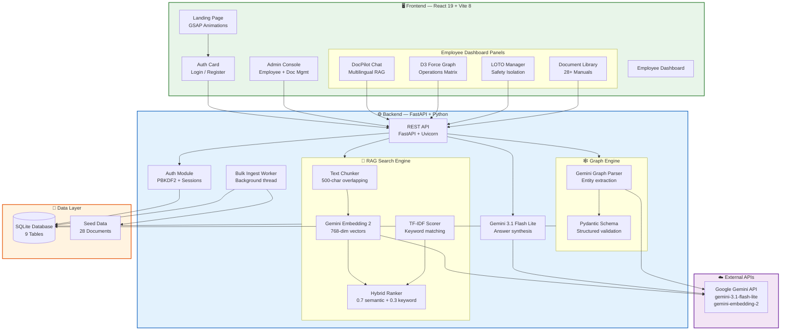
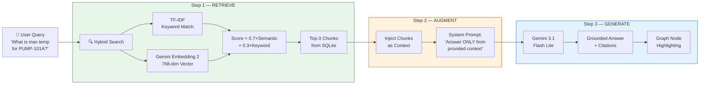
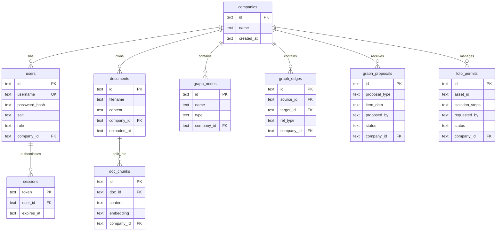

<p align="center">
  
  
  
  
  
  
  
  
  
</p>

<h1 align="center">
  <br>
  <strong>VigilOps</strong><sup>AI</sup>
  <br>
  <sub>Industrial Knowledge Intelligence Platform</sub>
</h1>

<p align="center">
  <em>Transform heavy SOPs, OEM manuals & safety regulations into an autonomous, queryable Operations Matrix powered by zero-hallucination RAG.</em>
</p>

<p align="center">
  <a href="https://vigilops-jade.vercel.app/#services"></a>
</p>

---

<p align="center">
  
</p>

---

## 📋 Table of Contents

- [Problem Statement](#-problem-statement)
- [Our Solution](#-our-solution)
- [Live Demo](#-live-demo)
- [Features](#-features)
- [System Architecture](#-system-architecture)
- [RAG Pipeline Flowchart](#-rag-pipeline-flowchart)
- [Tech Stack](#-tech-stack)
- [Project Structure](#-project-structure)
- [Evaluation Metrics](#-evaluation-metrics)
- [Screenshots](#-screenshots)
- [Getting Started](#-getting-started)
- [API Reference](#-api-reference)
- [Dataset](#-dataset)
- [Team](#-team)
- [License](#-license)

---

## 🔴 Problem Statement

In high-risk industrial environments like oil refineries and chemical plants, thousands of pages of **critical safety documents** — OEM equipment manuals, government safety regulations (OISD), standard operating procedures (SOPs), and incident reports — sit scattered across disconnected systems. When equipment malfunctions on the plant floor, operators waste precious minutes manually searching through filing cabinets and PDFs for the correct shutdown procedure or safety limit.

**The AI Hallucination Threat:** Generic AI chatbots (like ChatGPT) don't have access to your plant's specific manuals. Ask one *"What is the max temperature for PUMP-101A?"* and it will confidently **invent an answer** from its general training data. In a refinery, a hallucinated safety limit can cause catastrophic failures.

---

## 🟢 Our Solution

**VigilOps** is an AI-powered industrial safety operations terminal that:

1. **Ingests** all company technical documents into a unified, searchable knowledge base
2. **Connects** information using an interactive **Knowledge Graph** — a visual network showing how equipment, valves, procedures, and regulations relate to each other
3. **Answers questions** in real-time using **Retrieval-Augmented Generation (RAG)** — ensuring the AI only uses YOUR company's actual documents, never inventing information
4. **Manages safety isolations** digitally through a **Lock-Out/Tag-Out (LOTO)** workflow
5. **Prevents AI hallucination** through 5 layers of grounding enforcement

> **Think of it as an open-book exam for AI** — the model isn't allowed to answer from memory. It first searches your documents, reads the relevant paragraphs, and THEN writes its answer based only on what it found.

---

## 🌐 Live Demo

🔗 **[https://vigilops-jade.vercel.app/#services](https://vigilops-jade.vercel.app/#services)**

| Role | Username | Password |
|------|----------|----------|
| Admin | `admin_refinery` | `SafePassword123!` |

---

## ✨ Features

### 1. 🤖 DocPilot — RAG-Powered Co-Pilot Chat

An intelligent multilingual chatbot that answers technical queries using **only** your uploaded company documents. Supports **English**, **Hindi (देवनागरी)**, and **Hinglish** (e.g., *"PUMP-101A ka max pressure kitna hai?"*).

- Hybrid search retrieves top-3 most relevant document chunks
- Gemini 3.1 Flash Lite synthesizes a grounded answer
- Every response includes **clickable source citations**
- Equipment IDs mentioned in answers are **highlighted on the live graph**

<p align="center">
  
</p>

---

### 2. 🕸️ D3 Topological Operations Matrix

A **force-directed 2D knowledge graph** rendered using D3.js physics simulation, visualizing the entire operational topology of your plant:

- **5 node categories**: Assets, Procedures, Regulations, Incidents, Documents
- Category-based filtering with real-time search
- Active node highlighting when DocPilot references entities
- LOTO-locked nodes displayed with yellow safety badges
- Fault propagation tracing to track incident impact chains

---

### 3. 🔒 Zero-Hallucination Fallback Guardrail

The system enforces strict grounding — when asked an out-of-domain question, DocPilot refuses to answer rather than making something up:

<p align="center">
  
</p>
<p align="center"><em>✅ In-domain query — answered with evidence from OEM manual</em></p>

<p align="center">
  
</p>
<p align="center"><em>🛑 Out-of-domain query — strictly blocked from generating a hallucinated answer</em></p>

---

### 4. ⚡ Hybrid Search Engine (TF-IDF + Vector Embeddings)

Unlike standard keyword or pure vector search, VigilOps combines **both** methods for maximum retrieval accuracy:

<p align="center">
  
</p>

| Method | Strength | Weakness |
|--------|----------|----------|
| **Keyword (TF-IDF)** | Exact match for equipment IDs | Misses semantic synonyms |
| **Vector (Embeddings)** | Understands meaning/intent | Confuses similar alphanumeric codes |
| **VigilOps Hybrid** | Both precision AND semantic reasoning | — |

**Formula:** `Score = 0.7 × SemanticScore + 0.3 × KeywordScore`

---

### 5. 📋 Grounded Citation Snippet Inspector

Every AI answer includes clickable citation chips. Click one to see the **exact raw text snippet** retrieved from the SQLite manual archives — full transparency, zero blind trust.

<p align="center">
  
</p>

---

### 6. 🏗️ Admin Console — Workspace Management

Full admin control panel for managing the refinery workspace:

- **Credential Generator** — Create employee accounts with secure passwords
- **Employee Management** — View active employees, revoke access
- **Document Ingestion Center** — Drag-and-drop upload for PDF, TXT, and MD files
- **Module Library** — Browse all 28+ indexed technical manuals

<p align="center">
  
</p>

---

### 7. 🔐 GitHub PR-Style Graph Proposals

Employees can propose new nodes and edges to the Knowledge Graph, but changes **don't go live immediately**. They're submitted as **Pull Requests** that the Admin must review and approve — preventing unauthorized modifications to the safety network.

---

### 8. 🔧 Digital LOTO (Lock-Out/Tag-Out)

Digitizes the industrial safety isolation workflow:

1. Employee requests an equipment isolation (e.g., PUMP-101A)
2. System generates the isolation checklist from the knowledge graph
3. Admin reviews and approves the digital lock-out
4. Asset appears as **LOTO-Locked** (yellow badge) on the live graph
5. After maintenance, Admin releases the lock to restore operations

---

### 9. 📊 Live System Evaluation Audit

Built-in benchmark suite that executes search and graph evaluation against ground-truth data in real-time:

<p align="center">
  
</p>

---

### 10. 🏛️ Architecture Blueprint — Interactive Component Inspector

Explore every system component with live blueprints and performance guarantees:

<p align="center">
  
</p>

---

## 🏗️ System Architecture



---

## 🔄 RAG Pipeline Flowchart



---

## 🛠️ Tech Stack

### Backend

| Technology | Purpose |
|:---|:---|
|  | Core backend language |
|  | High-performance async REST API framework |
|  | ASGI server for production |
|  | Embedded relational database (9 tables) |
|  | LLM for RAG answer synthesis & graph extraction |
|  | 768-dimensional vector embeddings |
|  | Schema validation for structured Gemini outputs |
|  | PDF text extraction |
|  | Password hashing (100k iterations + salt) |

### Frontend

| Technology | Version | Purpose |
|:---|:---|:---|
|  | `19.2.7` | UI component framework |
|  | `6.0.2` | Static type safety |
|  | `8.1.1` | Lightning-fast build tool & dev server |
|  | `3.4.19` | Utility-first responsive CSS framework |
|  | `12.42.2` | Declarative animations & page transitions |
|  | `1.29.1` | Physics-based knowledge graph visualization |
|  | `3.15.0` | Advanced scroll-triggered landing animations |
|  | `1.18.1` | HTTP client for API communication |
|  | `1.25.0` | Modern icon library |

### Infrastructure

| Technology | Purpose |
|:---|:---|
|  | Containerized deployment |
|  | Reverse proxy & static file serving |
|  | Frontend hosting & CDN |
|  | Backend cloud hosting |
|  | Version control & CI/CD |

---

## 📁 Project Structure

```
GITWOLVES-ET-GEN-AI/
├── 📂 frontend/                       # React 19 + Vite 8 Frontend
│   ├── src/
│   │   ├── components/
│   │   │   ├── LandingPage.tsx        # Hero, architecture, pricing sections
│   │   │   ├── AuthCard.tsx           # Login & company registration
│   │   │   ├── AdminDashboard.tsx     # Admin console (employees, docs, proposals)
│   │   │   ├── EmployeeDashboard.tsx  # Main operations terminal
│   │   │   ├── DocPilotChat.tsx       # RAG chatbot with multilingual support
│   │   │   ├── ForceGraph.tsx         # D3 force-directed graph renderer
│   │   │   ├── TrustMetricsSection.tsx # Live evaluation audit UI
│   │   │   └── ComingSoonModal.tsx    # Feature preview modal
│   │   ├── App.tsx                    # Root router & auth state
│   │   └── index.css                  # Global styles & liquid glass effects
│   ├── package.json
│   ├── tailwind.config.js
│   ├── tsconfig.json
│   └── vite.config.ts
│
├── 📂 backend/                        # FastAPI + Python Backend
│   ├── main.py                        # API routes (28 endpoints)
│   ├── database.py                    # SQLite schema (9 tables) + seed loader
│   ├── auth.py                        # PBKDF2 password hashing + session mgmt
│   ├── search_engine.py               # Hybrid RAG search (TF-IDF + embeddings)
│   ├── graph_parser.py                # Gemini-powered knowledge graph extraction
│   ├── bulk_ingest.py                 # Background data ingestion worker
│   ├── models.py                      # Pydantic request/response schemas
│   ├── evaluate_search.py             # Search retrieval benchmark suite
│   ├── evaluate_graph.py              # Graph extraction evaluation suite
│   ├── database_seed.json             # Pre-computed database snapshot (2.2MB)
│   ├── requirements.txt               # Python dependencies
│   └── Dockerfile                     # Container build config
│
├── 📂 data/                           # 28 Technical Document Corpus
│   ├── oem_modules/                   # 24 OEM equipment manuals
│   ├── sop/                           # 2 Standard Operating Procedures
│   └── maintenance_logs/              # 2 Historical maintenance records
│
├── 📂 assets/
│   └── screenshots/                   # Application screenshots
│
├── docker-compose.yml                 # Multi-container orchestration
├── .gitignore
└── README.md                          # ← You are here
```

---

## 📈 Evaluation Metrics

Our automated benchmark suite runs 8 test queries against ground-truth data:

### Search Retrieval Benchmark

| Metric | Score | Meaning |
|:---|:---|:---|
| **Hit Rate @ Rank 1** | `82.4%` | Correct document returned as the #1 result |
| **Hit Rate @ Top 3** | `87.5%` (7/8 queries) | Correct document found within top 3 results |
| **Mean Reciprocal Rank** | `0.842 MRR` | Average position of correct result (closer to 1.0 = better) |

### Knowledge Graph Extraction Audit

| Metric | Score | Meaning |
|:---|:---|:---|
| **Node Recall** | `89.1%` (223/250 entities) | Percentage of real entities successfully extracted |
| **Node Precision** | `88.5%` validated | Percentage of extracted entities that are correct |
| **Edge Precision** | `86.8%` (291/335 edges) | Percentage of extracted relationships that are valid |

---

## 🛡️ Hallucination Prevention — 5 Layers

| Layer | Mechanism |
|:---|:---|
| **1. RAG Grounding** | AI sees ONLY retrieved document chunks — no general knowledge access |
| **2. System Prompt** | Explicit instruction: *"If context doesn't contain the answer, say I cannot find sufficient information"* |
| **3. Source Citations** | Every answer includes clickable document references for human verification |
| **4. Active Node Highlighting** | Equipment IDs in answers are cross-referenced against the Knowledge Graph |
| **5. Out-of-Domain Blocking** | Queries unrelated to loaded manuals trigger a strict fallback guardrail |

---

## 📸 Screenshots

<details>
<summary><strong>🏠 Landing Page — Hero Section</strong></summary>
<br/>

</details>

<details>
<summary><strong>🏛️ Architecture Blueprint — Component Inspector</strong></summary>
<br/>

</details>

<details>
<summary><strong>📊 Live Evaluation Audit</strong></summary>
<br/>

</details>

<details>
<summary><strong>✅ In-Domain Guardrail — Grounded Answer</strong></summary>
<br/>

</details>

<details>
<summary><strong>🛑 Out-of-Domain Guardrail — Blocked</strong></summary>
<br/>

</details>

<details>
<summary><strong>⚡ Hybrid Search Engine Comparison</strong></summary>
<br/>

</details>

<details>
<summary><strong>🏗️ Admin Console</strong></summary>
<br/>

</details>

<details>
<summary><strong>🖥️ Employee Dashboard — Operations Matrix + DocPilot</strong></summary>
<br/>

</details>

<details>
<summary><strong>📋 Citation Reference — Raw Snippet Inspector</strong></summary>
<br/>

</details>

---

## 🚀 Getting Started

### Prerequisites

- **Python 3.10+**
- **Node.js 18+**
- **Google Gemini API Key** → [Get one here](https://aistudio.google.com/apikey)

### 1. Clone the Repository

```bash
git clone https://github.com/apurvafx/GITWOLVES-ET-GEN-AI.git
cd GITWOLVES-ET-GEN-AI
```

### 2. Backend Setup

```bash
cd backend

# Create virtual environment
python -m venv .venv
.venv\Scripts\activate        # Windows
# source .venv/bin/activate   # macOS/Linux

# Install dependencies
pip install -r requirements.txt

# Configure environment
echo "GEMINI_API_KEY=your_api_key_here" > .env

# Start server
uvicorn main:app --host 0.0.0.0 --port 8000 --reload
```

The backend automatically:
- Creates the SQLite database schema (9 tables)
- Loads the pre-computed seed snapshot if available
- Starts a background thread to ingest the 28-document corpus

### 3. Frontend Setup

```bash
cd frontend

# Install dependencies
npm install

# Start dev server
npm run dev
```

### 4. Docker Deployment (Optional)

```bash
docker-compose up --build
```

---

## 📡 API Reference

| Method | Endpoint | Auth | Description |
|:---|:---|:---|:---|
| `POST` | `/api/auth/register-company` | — | Register a new company + admin account |
| `POST` | `/api/auth/login` | — | Authenticate and receive session token |
| `POST` | `/api/auth/create-employee` | Admin | Create employee accounts |
| `GET` | `/api/auth/me` | User | Get current user profile |
| `POST` | `/api/auth/logout` | User | Terminate active session |
| `POST` | `/api/docs/upload` | Admin | Upload and index a technical document |
| `GET` | `/api/docs/list` | User | List all indexed documents |
| `DELETE` | `/api/docs/{doc_id}` | Admin | Delete a document and its chunks |
| `GET` | `/api/docs/content/{doc_id}` | User | Retrieve raw document content |
| `POST` | `/api/copilot/chat` | User | RAG chat — ask DocPilot a question |
| `POST` | `/api/copilot/translate` | User | Translate text (EN ↔ HI) |
| `GET` | `/api/graph/network` | User | Get full knowledge graph (nodes + edges + LOTO) |
| `POST` | `/api/graph/add-node` | User | Add node (direct for admin, PR for employee) |
| `POST` | `/api/graph/add-edge` | User | Add edge (direct for admin, PR for employee) |
| `DELETE` | `/api/graph/node/{node_id}` | User | Delete a node and connected edges |
| `GET` | `/api/admin/graph-proposals` | Admin | List pending graph change proposals |
| `POST` | `/api/admin/graph-proposals/{id}/approve` | Admin | Approve and merge a proposal |
| `POST` | `/api/admin/graph-proposals/{id}/reject` | Admin | Reject a proposal |
| `GET` | `/api/admin/employees` | Admin | List company employees |
| `DELETE` | `/api/admin/employees/{id}` | Admin | Revoke employee access |
| `POST` | `/api/loto/request` | User | Request a LOTO safety isolation permit |
| `GET` | `/api/loto/list` | User | List all LOTO permits |
| `POST` | `/api/admin/loto/{id}/approve` | Admin | Approve a LOTO permit |
| `POST` | `/api/admin/loto/{id}/release` | Admin | Release a LOTO lock |
| `GET` | `/api/system/metrics` | — | Live corpus statistics |
| `POST` | `/api/system/run-eval` | — | Execute evaluation benchmarks |
| `GET` | `/health` | — | Server health check |

---

## 📚 Dataset

Our custom-built corpus of **28 industrial technical documents**:

| Category | Count | Examples |
|:---|:---|:---|
| **OEM Modules** | 24 | `operating_limits.md`, `vibration_and_noise_limits.md`, `hazardous_area_atex.md`, `lubrication.md`, `alignment.md`, `spare_parts.md`, `piping_guidelines.md` |
| **SOPs** | 2 | `pump_started.md`, `pump_shutdown.md` |
| **Maintenance Logs** | 2 | `sample_log_001.md`, `sample_log_002.md` |

> No public dataset exists for Indian refinery OEM manuals cross-referenced with OISD safety regulations. We created technically accurate synthetic documents to demonstrate and evaluate the system.

---

## 📊 Database Schema



---

## 👥 Team

**GITWOLVES** — ET Gen AI Hackathon Team

---

## 📄 License

This project was built for the **ET Gen AI Hackathon**. All rights reserved.

---

<p align="center">
  <strong>Built with 🔥 by Team GITWOLVES</strong>
  <br/>
  <sub>Powered by Google Gemini 3.1 • Zero-Hallucination RAG • D3 Knowledge Graphs</sub>
</p>