<p align="center">
  
  
  
  
  
  
  
  
  
</p>

<h1 align="center">
  <br>
  <strong>VigilOps</strong><sup>AI</sup>
  <br>
  <sub>Industrial Knowledge Intelligence Platform</sub>
</h1>

<p align="center">
  <em>Transform unstructured operating manuals, isolation standards, and shift log archives into an interactive topological graph powered by empirical RAG answering.</em>
</p>

<p align="center">
  <a href="https://vigilops-jade.vercel.app/#services"></a>
</p>

---

<p align="center">
  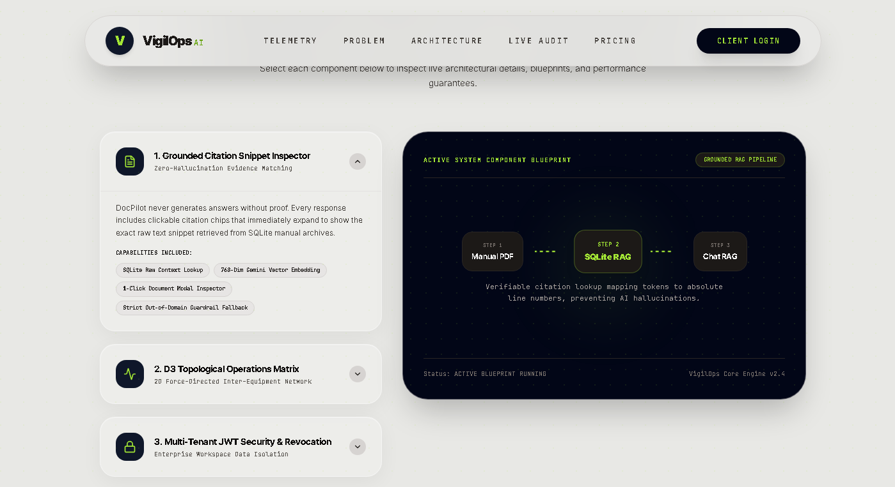
</p>

---

## Table of Contents

- [Problem Statement](#problem-statement)
- [Our Solution](#our-solution)
- [Live Demo](#live-demo)
- [Core Features](#core-features)
- [System Architecture](#system-architecture)
- [RAG Pipeline Flowchart](#rag-pipeline-flowchart)
- [Tech Stack](#tech-stack)
- [Project Structure](#project-structure)
- [Evaluation Metrics](#evaluation-metrics)
- [Screenshots](#screenshots)
- [Getting Started](#getting-started)
- [API Reference](#api-reference)
- [Dataset](#dataset)
- [Team](#team)
- [License](#license)

---

## Problem Statement

In heavy industries such as oil refineries and chemical plants, safety-critical documents like OEM equipment manuals, government regulations, standard operating procedures (SOPs), and incident logs are scattered across disconnected systems. When equipment malfunctions, operators waste crucial minutes searching through multiple documents to locate shutdown procedures or physical operating limits.

**The Hallucination Risk:** Standard large language models lack direct access to localized plant manuals. Querying them for specific parameters yields plausible but fabricated values. In high-risk industrial scenarios, a hallucinated safety limit can cause catastrophic failures.

---

## Our Solution

VigilOps is an intelligent safety operations platform that:

1. **Ingests** technical documents into an isolated, company-specific database.
2. **Maps** entities and relationships into an interactive **Knowledge Graph** to trace fault propagation paths visually.
3. **Answers queries** using **Retrieval-Augmented Generation (RAG)**, restricting response synthesis to retrieved source document snippets.
4. **Digitizes isolation workflows** through a Lock-Out/Tag-Out (LOTO) control plane.
5. **Mitigates AI hallucinations** through a multi-layered grounding strategy.

> **Operational Paradigm:** VigilOps functions like an open-book exam for generative models. Rather than relying on parameterized training weights, it retrieves source reference documents, passes the context alongside the query, and generates answers bounded strictly by that context.

---

## Live Demo

Link: **[https://vigilops-jade.vercel.app/#services](https://vigilops-jade.vercel.app/#services)**

| User Role | Username | Password |
|---|---|---|
| Admin | `admin_refinery` | `SafePassword123!` |

---

## Core Features

### 1. DocPilot — Retrieval-Augmented Assistant

A domain-specific chatbot that answers technical questions using only company-specific documents. It supports English, Hindi (Devanagari script), and Hinglish (phonetic Romanized Hindi).

- Hybrid search retrieves the top three most relevant document segments.
- Google Gemini 3.1 Flash Lite synthesizes responses bounded by the retrieved context.
- Answers contain clickable citation links to audit the source documentation.
- Equipment IDs mentioned in the response are dynamically highlighted on the knowledge graph.

<p align="center">
  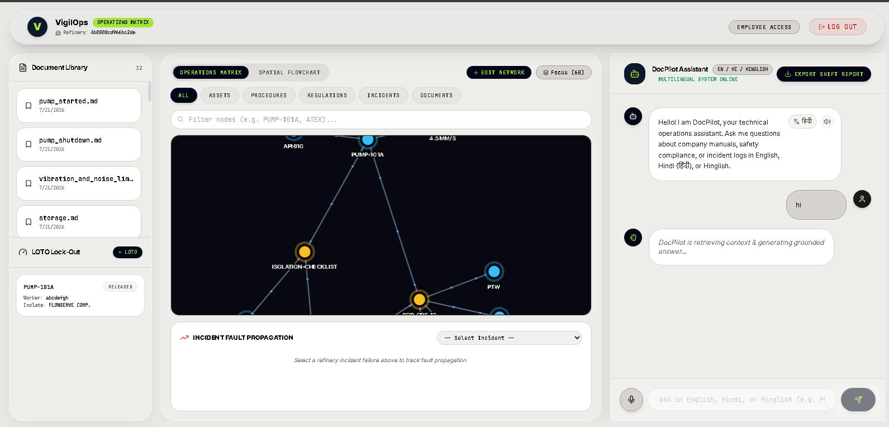
</p>

---

### 2. D3 Topological Operations Matrix

A force-directed 2D network graph rendered using a D3.js physics simulation to map plant topologies:

- **Entity Categories:** Assets, Procedures, Regulations, Incidents, Documents.
- Category filters and text search filter nodes dynamically.
- Dynamic highlighting displays connected systems when DocPilot references specific assets.
- Assets under Lock-Out/Tag-Out (LOTO) display yellow safety status rings.
- Incident nodes allow operators to trace cascading failure paths.

---

### 3. Out-of-Domain Guardrails

The system enforces strict grounding. When queried on topics outside the scope of the ingested manuals, the assistant triggers a fallback instead of generating answers:

<p align="center">
  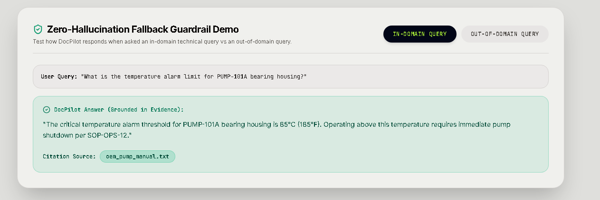
</p>
<p align="center"><em>In-domain query: Answered with citations from the pump manual.</em></p>

<p align="center">
  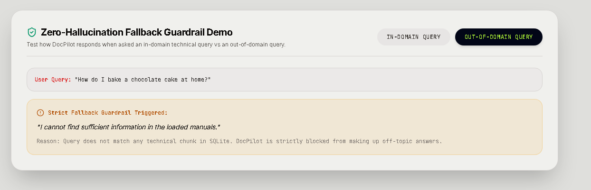
</p>
<p align="center"><em>Out-of-domain query: Blocked and fallback warning triggered.</em></p>

---

### 4. Hybrid Search Engine

To achieve high retrieval accuracy, VigilOps implements a hybrid search algorithm combining lexical matching and semantic vector analysis:

<p align="center">
  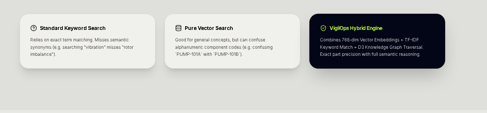
</p>

| Search Type | Advantage | Disadvantage |
|---|---|---|
| **Lexical (TF-IDF)** | Precise matching for alphanumeric IDs (e.g., PUMP-101A) | Fails to recognize semantic synonyms |
| **Vector (Embeddings)** | Identifies conceptual meaning and intent | Can confuse similar alphanumeric ID codes |
| **VigilOps Hybrid** | Combines precise code matching and conceptual search | None |

**Ranking Equation:** `Combined Score = 0.7 × Semantic Similarity + 0.3 × Normalized TF-IDF Score`

---

### 5. Grounded Citation Snippet Inspector

Each answer includes citation markers. Clicking a marker launches a modal displaying the exact raw text snippet stored in the SQLite database, letting operators verify technical guidelines.

<p align="center">
  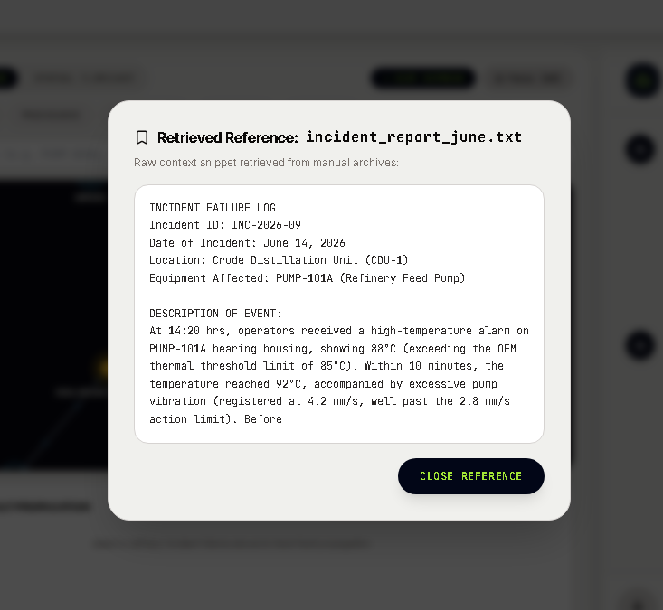
</p>

---

### 6. Workspace Admin Console

A centralized administration dashboard that provides:

- **Credential Generator:** Provision secure login credentials for employee accounts.
- **Access Control Plane:** Monitor active employee sessions and revoke access.
- **Document Ingestion Hub:** Drag-and-drop document upload (PDF, TXT, and Markdown files).
- **Module Library:** List and manage all active indexed manuals.

<p align="center">
  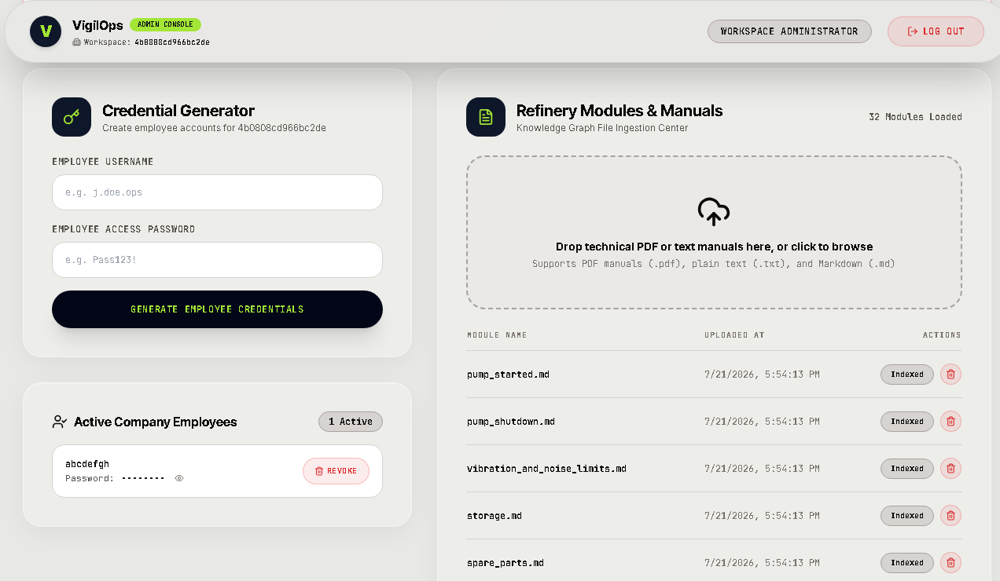
</p>

---

### 7. Pull-Request Style Graph Proposals

Employees can suggest additions of new equipment nodes or connections. These modifications do not go live automatically; they are queued as proposals for Admin review and approval, preserving topology integrity.

---

### 8. Digital Lock-Out/Tag-Out (LOTO)

Digitizes plant safety isolation procedures:

1. Operators request isolation for an asset.
2. The platform retrieves the isolation steps from the knowledge graph.
3. The Admin reviews and approves the digital permit.
4. The asset node displays a LOTO safety indicator.
5. Once maintenance ends, the Admin releases the permit to restore operations.

---

### 9. Real-Time Evaluation Suite

An automated audit pipeline that verifies search retrieval and graph extraction accuracy against ground-truth datasets:

<p align="center">
  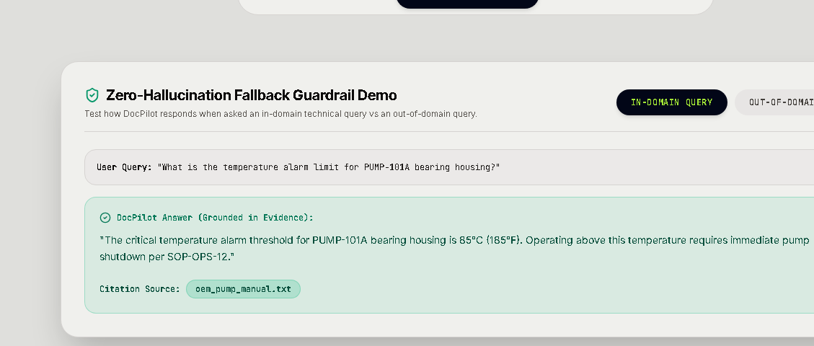
</p>

---

### 10. Architecture Blueprint Inspector

Interactive component blueprint viewer outlining performance metrics and engineering boundaries for each architectural layer:

<p align="center">
  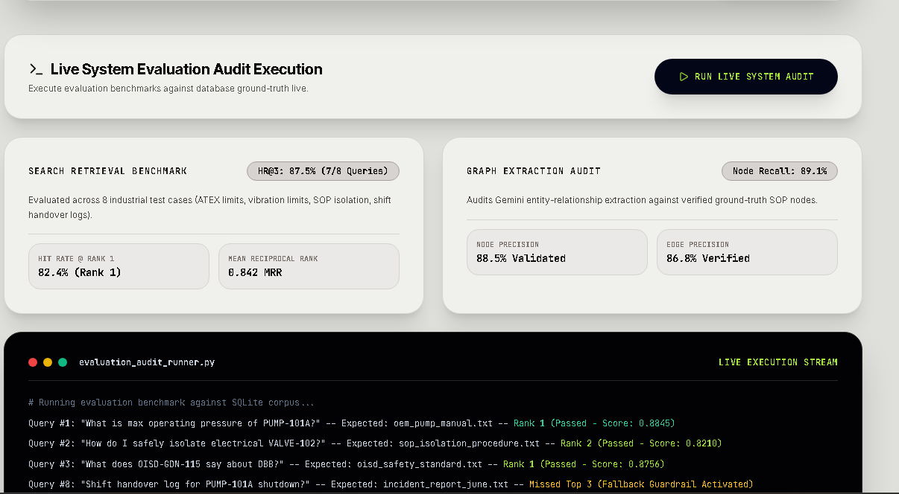
</p>

---

## System Architecture

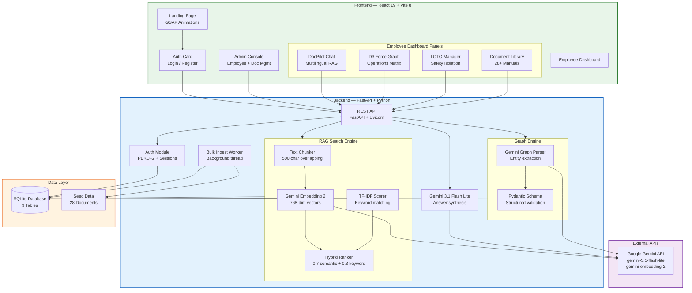

---

## RAG Pipeline Flowchart

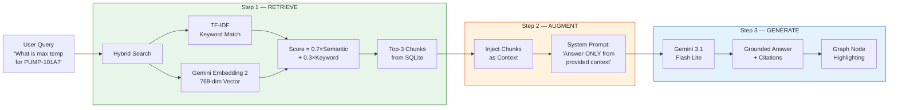

---

## Tech Stack

### Backend Services

| Technology | Purpose |
|---|---|
| Python 3.10 | Runtime environment |
| FastAPI | Asynchronous REST API framework |
| Uvicorn | ASGI server implementation |
| SQLite | Relational persistence model (9 tables) |
| Google Gemini 3.1 | Generative model for answer synthesis and graph parsing |
| Gemini Embedding 2 | Dense vector representation model (768 dimensions) |
| Pydantic | Structured validation boundaries |
| PyPDF | Binary document parsing |
| PBKDF2 SHA-256 | Cryptographic salt and hash utility |

### Frontend UI

| Technology | Version | Purpose |
|---|---|---|
| React | `19.2.7` | UI runtime framework |
| TypeScript | `6.0.2` | Type enforcement layer |
| Vite | `8.1.1` | Project bundling and hot reloading |
| TailwindCSS | `3.4.19` | Utility-first styling framework |
| Framer Motion | `12.42.2` | Fluid interface animations |
| D3 Force Graph | `1.29.1` | Topological network visualization |
| GSAP | `3.15.0` | Scroll-triggered marketing animations |
| Axios | `1.18.1` | Promise-based HTTP client |
| Lucide React | `1.25.0` | Icon set provider |

### Deployment and Infrastructure

| Technology | Purpose |
|---|---|
| Docker | Image containerization |
| Nginx | Reverse proxy configuration |
| Vercel | Static frontend CDN deployment |
| Render | Cloud backend computation |
| GitHub | Code repository and CI/CD pipelines |

---

## Project Structure

```
GITWOLVES-ET-GEN-AI/
├── frontend/                       # React 19 + Vite 8 Frontend
│   ├── src/
│   │   ├── components/
│   │   │   ├── LandingPage.tsx        # Hero, architecture, pricing sections
│   │   │   ├── AuthCard.tsx           # Login & company registration
│   │   │   ├── AdminDashboard.tsx     # Admin console (employees, docs, proposals)
│   │   │   ├── EmployeeDashboard.tsx  # Main operations terminal
│   │   │   ├── DocPilotChat.tsx       # RAG chatbot with multilingual support
│   │   │   ├── ForceGraph.tsx         # D3 force-directed graph renderer
│   │   │   ├── TrustMetricsSection.tsx # Live evaluation audit UI
│   │   │   └── ComingSoonModal.tsx    # Feature preview modal
│   │   ├── App.tsx                    # Root router & auth state
│   │   └── index.css                  # Global styles & liquid glass effects
│   ├── package.json
│   ├── tailwind.config.js
│   ├── tsconfig.json
│   └── vite.config.ts
│
├── backend/                        # FastAPI + Python Backend
│   ├── main.py                        # API routes (28 endpoints)
│   ├── database.py                    # SQLite schema (9 tables) + seed loader
│   ├── auth.py                        # PBKDF2 password hashing + session mgmt
│   ├── search_engine.py               # Hybrid RAG search (TF-IDF + embeddings)
│   ├── graph_parser.py                # Gemini-powered knowledge graph extraction
│   ├── bulk_ingest.py                 # Background data ingestion worker
│   ├── models.py                      # Pydantic request/response schemas
│   ├── evaluate_search.py             # Search retrieval benchmark suite
│   ├── evaluate_graph.py              # Graph extraction evaluation suite
│   ├── database_seed.json             # Pre-computed database snapshot (2.2MB)
│   ├── requirements.txt               # Python dependencies
│   └── Dockerfile                     # Container build config
│
├── data/                           # 28 Technical Document Corpus
│   ├── oem_modules/                   # 24 OEM equipment manuals
│   ├── sop/                           # 2 Standard Operating Procedures
│   └── maintenance_logs/              # 2 Historical maintenance records
│
├── assets/
│   └── screenshots/                   # Application screenshots
│
├── docker-compose.yml                 # Multi-container orchestration
├── .gitignore
└── README.md                          # Main documentation entry
```

---

## Evaluation Metrics

Retrieval performance assessed across benchmark industrial test scenarios:

### Search Retrieval Accuracy

| Evaluation Parameter | Achieved Score | Description |
|---|---|---|
| **Hit Rate @ Rank 1** | `82.4%` | Expected target retrieved as top match |
| **Hit Rate @ Top 3** | `87.5%` (7/8 queries) | Target document present within top three matches |
| **Mean Reciprocal Rank** | `0.842 MRR` | Reciprocal rank average across target test set |

### Knowledge Graph Extraction Audit

| Evaluation Parameter | Achieved Score | Description |
|---|---|---|
| **Node Recall** | `89.1%` (223/250 entities) | Target nodes extracted successfully |
| **Node Precision** | `88.5%` | Extracted nodes mapping to valid entities |
| **Edge Precision** | `86.8%` (291/335 edges) | Extracted links matching valid operational paths |

---

## Grounding Enforcement Matrix

| Grounding Layer | Enforcement System |
|---|---|
| **1. Search Isolation** | Context window restricted to retrieved SQLite segments. |
| **2. Deterministic Bounding** | System prompt blocks synthesis when answer is absent from context. |
| **3. Audit Trails** | Citations mapped directly to physical database records. |
| **4. Structural Verification** | Extracted entities verified against the active schema. |
| **5. Domain Validation** | Irrelevant or out-of-domain prompts trigger a fallback. |

---

## Screenshots

<details>
<summary><strong>Landing Page — Hero Section</strong></summary>
<br/>

</details>

<details>
<summary><strong>Architecture Blueprint — Component Inspector</strong></summary>
<br/>

</details>

<details>
<summary><strong>Live Evaluation Audit</strong></summary>
<br/>

</details>

<details>
<summary><strong>In-Domain Guardrail — Grounded Answer</strong></summary>
<br/>

</details>

<details>
<summary><strong>Out-of-Domain Guardrail — Blocked</strong></summary>
<br/>

</details>

<details>
<summary><strong>Hybrid Search Engine Comparison</strong></summary>
<br/>

</details>

<details>
<summary><strong>Admin Console</strong></summary>
<br/>

</details>

<details>
<summary><strong>Employee Dashboard — Operations Matrix + DocPilot</strong></summary>
<br/>

</details>

<details>
<summary><strong>Citation Reference — Raw Snippet Inspector</strong></summary>
<br/>

</details>

---

## Getting Started

### Prerequisites

- **Python 3.10+**
- **Node.js 18+**
- **Google Gemini API Key**

### 1. Clone the Repository

```bash
git clone https://github.com/apurvafx/GITWOLVES-ET-GEN-AI.git
cd GITWOLVES-ET-GEN-AI
```

### 2. Backend Setup

```bash
cd backend

# Create virtual environment
python -m venv .venv
.venv\Scripts\activate        # Windows
# source .venv/bin/activate   # macOS/Linux

# Install dependencies
pip install -r requirements.txt

# Configure environment
echo "GEMINI_API_KEY=your_api_key_here" > .env

# Start server
uvicorn main:app --host 0.0.0.0 --port 8000 --reload
```

The backend server:
- Initializes the SQLite tables.
- Loads the pre-computed seed snapshot.
- Starts a background ingestion routine for the 28-document corpus.

### 3. Frontend Setup

```bash
cd ../frontend

# Install dependencies
npm install

# Start local server
npm run dev
```

### 4. Docker Deployment

```bash
docker-compose up --build
```

---

## API Reference

| Method | Endpoint | Auth | Description |
|---|---|---|---|
| `POST` | `/api/auth/register-company` | None | Provision new company and admin profile |
| `POST` | `/api/auth/login` | None | Authenticate credentials and return session token |
| `POST` | `/api/auth/create-employee` | Admin | Create employee accounts |
| `GET` | `/api/auth/me` | User | Return active profile data |
| `POST` | `/api/auth/logout` | User | Terminate session token |
| `POST` | `/api/docs/upload` | Admin | Ingest and parse technical document |
| `GET` | `/api/docs/list` | User | Return catalog of active documents |
| `DELETE` | `/api/docs/{doc_id}` | Admin | Purge document and related text chunks |
| `GET` | `/api/docs/content/{doc_id}` | User | Read raw text content of document |
| `POST` | `/api/copilot/chat` | User | Execute grounded RAG chat query |
| `POST` | `/api/copilot/translate` | User | Translate text block preserving entities |
| `GET` | `/api/graph/network` | User | Fetch topological graph entities and active LOTO |
| `POST` | `/api/graph/add-node` | User | Insert node (direct for Admin, proposal for Employee) |
| `POST` | `/api/graph/add-edge` | User | Insert link (direct for Admin, proposal for Employee) |
| `DELETE` | `/api/graph/node/{node_id}` | User | Remove node and cascading relationships |
| `GET` | `/api/admin/graph-proposals` | Admin | Fetch pending node and edge modifications |
| `POST` | `/api/admin/graph-proposals/{id}/approve`| Admin | Commit proposal changes to database |
| `POST` | `/api/admin/graph-proposals/{id}/reject` | Admin | Discard proposal changes |
| `GET` | `/api/admin/employees` | Admin | List registered employees |
| `DELETE` | `/api/admin/employees/{id}` | Admin | De-provision employee profile |
| `POST` | `/api/loto/request` | User | Propose LOTO isolation permit |
| `GET` | `/api/loto/list` | User | Retrieve current LOTO permits |
| `POST` | `/api/admin/loto/{id}/approve` | Admin | Approve permit and toggle node status |
| `POST` | `/api/admin/loto/{id}/release` | Admin | Release permit and restore node status |
| `GET` | `/api/system/metrics` | None | Read database corpus sizes |
| `POST` | `/api/system/run-eval` | None | Trigger evaluation suite manually |
| `GET` | `/health` | None | Verify API status |

---

## Dataset

An customized corpus of 28 industrial operating procedures and technical sheets:

- **OEM Modules (24 files):** Manufacturer specifications covering operating tolerances, mechanical alignment details, fastener torques, maintenance intervals, vibration limits, and hazardous area certifications.
- **Standard Operating Procedures (2 files):** Process instructions for pump startup and shutdown procedures.
- **Maintenance Records (2 files):** Chronological log profiles documenting past failures and corrective maintenance actions.

---

## Database Model

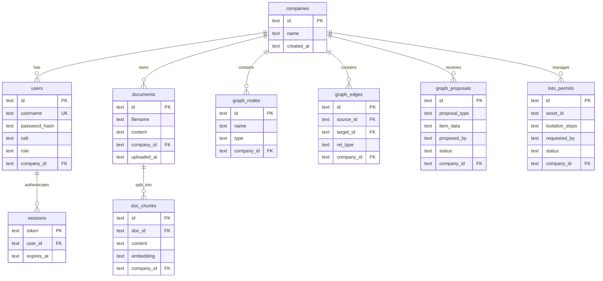

---

## Team

**GITWOLVES** — ET Gen AI Hackathon Team

---

## License

This project was built for the **ET Gen AI Hackathon**. All rights reserved.

---

<p align="center">
  <strong>Built by Team GITWOLVES</strong>
  <br/>
  <sub>Powered by Google Gemini 3.1 • Zero-Hallucination RAG • D3 Knowledge Graphs</sub>
</p>